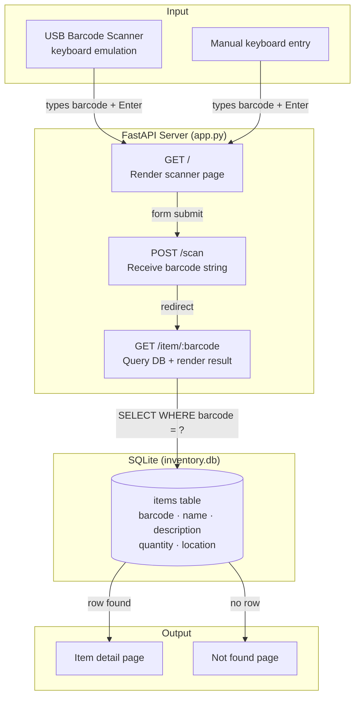

# inventory-tracker

Scan a barcode → look it up in a local database → display the item's info.
No cloud, no auth, no dependencies beyond Python.

---

## Architecture



---

## How It Works

1. **Browser loads `GET /`** — an input field is auto-focused, ready for scanner or keyboard input.
2. **Barcode arrives** — USB scanners act as keyboards and send the barcode string followed by Enter, which submits the form automatically.
3. **`POST /scan`** receives the barcode and immediately redirects to `GET /item/<barcode>`.
4. **`GET /item/<barcode>`** runs a single SQLite query. If a row exists, the item page renders. If not, a "not found" page renders.

No sessions, no auth, no background jobs. Each scan is one redirect + one DB read.

---

## File Structure

```
inventory-tracker/
├── app.py          # All route logic (3 routes, ~30 lines)
├── database.py     # SQLite connection + table creation
├── seed.py         # One-time script to populate sample data
├── inventory.db    # SQLite database (created on first run)
├── requirements.txt
└── templates/
    ├── index.html  # Scanner input page
    └── item.html   # Item display / not-found page
```

---

## Setup

```bash
python3 -m venv .venv
source .venv/bin/activate
pip install -r requirements.txt
python seed.py               # creates inventory.db with 3 sample items
uvicorn app:app --host "::" --port 8080
```

Open **http://localhost:8080**

---

## Usage

**With a USB scanner**
Plug in the scanner. The input field on the page is auto-focused — point the scanner at a barcode and pull the trigger. It submits automatically.

**Without a scanner**
Click into the input field, type a barcode, press Enter.

**Sample barcodes to test**

| Barcode       | Item                        |
|---------------|-----------------------------|
| 0123456789012 | Widget A — Shelf 4          |
| 9780131101630 | The C Programming Language  |
| 0000000000001 | Test Item — Lab             |

---

## Adding Items

Edit `inventory.db` with [DB Browser for SQLite](https://sqlitebrowser.org), or insert via Python:

```python
import sqlite3
conn = sqlite3.connect("inventory.db")
conn.execute(
    "INSERT INTO items (barcode, name, description, quantity, location) VALUES (?, ?, ?, ?, ?)",
    ("111222333", "My Part", "Some description", 10, "Bin 3")
)
conn.commit()
```

### Schema

| Column      | Type    | Required |
|-------------|---------|----------|
| barcode     | TEXT    | yes (unique) |
| name        | TEXT    | yes      |
| description | TEXT    | no       |
| quantity    | INTEGER | no (default 0) |
| location    | TEXT    | no       |

---

## Raspberry Pi

Same setup. Access from any device on the network:

```bash
uvicorn app:app --host "::" --port 8080
# then visit http://<pi-ip>:8080 from any browser on the same network
```

Scanner plugs into whichever machine has the browser open.
