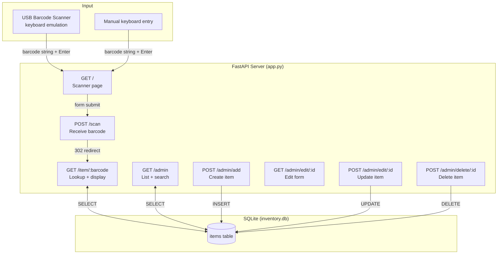

# Developer & Maintainer Guide

---

## Architecture



---

## File Structure

```
inventory-tracker/
├── app.py              # All route logic
├── database.py         # SQLite connection + schema init
├── seed.py             # Populate sample data (run once)
├── inventory.db        # SQLite database (auto-created)
├── requirements.txt
├── docs/
│   ├── user.md         # User guide (served at /docs/user)
│   ├── dev.md          # This file (served at /docs/dev)
│   └── data.md         # Data reference (served at /docs/data)
└── templates/
    ├── index.html      # Scanner input page
    ├── item.html       # Item display / not-found
    ├── admin.html      # Admin panel
    ├── admin_edit.html # Edit item form
    ├── docs_index.html # Docs landing page
    └── docs_page.html  # Shared docs wrapper
```

---

## Routes

| Method | Path                  | Description                        |
|--------|-----------------------|------------------------------------|
| GET    | `/`                   | Scanner input page                 |
| POST   | `/scan`               | Receive barcode, redirect to item  |
| GET    | `/item/{barcode}`     | Display item info                  |
| GET    | `/admin`              | List all items, search             |
| POST   | `/admin/add`          | Insert new item                    |
| GET    | `/admin/edit/{id}`    | Edit form for an item              |
| POST   | `/admin/edit/{id}`    | Update item                        |
| POST   | `/admin/delete/{id}`  | Delete item                        |
| GET    | `/docs`               | Docs landing page                  |
| GET    | `/docs/{section}`     | user / dev / data                  |

---

## Setup

```bash
git clone <repo>
cd inventory-tracker
python3 -m venv .venv
source .venv/bin/activate
pip install -r requirements.txt
python seed.py        # creates inventory.db with sample data
uvicorn app:app --host "::" --port 8080
```

---

## Dependencies

| Package          | Purpose                              |
|------------------|--------------------------------------|
| fastapi          | Web framework + routing              |
| uvicorn          | ASGI server                          |
| jinja2           | HTML templating                      |
| python-multipart | Parsing HTML form POST bodies        |
| markdown         | Rendering `.md` files to HTML        |

All data is stored in a single SQLite file (`inventory.db`) — no database server required.

---

## Raspberry Pi Deployment

Same setup as above. To make it accessible on the local network:

```bash
uvicorn app:app --host "::" --port 8080
```

Access from any device on the same network at `http://<pi-ip>:8080`.

**Scanner placement:** USB scanners emulate a keyboard and must be connected to whichever machine has the browser open — either the Pi directly, or a laptop pointed at the Pi's IP.

**Storage:** Prefer a USB SSD over a microSD card to avoid corruption. Back up `inventory.db` regularly.

---

## Adding a New Field

1. Add the column in `database.py` inside `init_db()`
2. Add the field to the `INSERT` and `UPDATE` queries in `app.py`
3. Add the input to `templates/admin.html` and `templates/admin_edit.html`
4. Add the field to `templates/item.html` for display

For existing databases, run the migration manually:

```bash
sqlite3 inventory.db "ALTER TABLE items ADD COLUMN new_field TEXT;"
```
